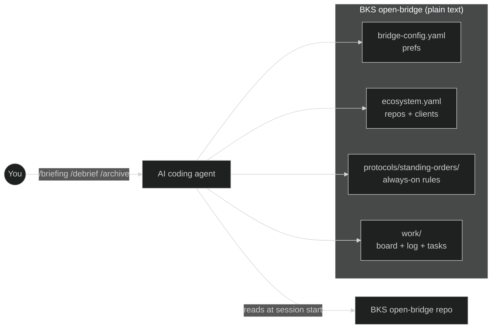

# BKS open-bridge

**A plain-text git repo your coding agent reads at session start — so it already knows your repos, your clients, and what you shipped yesterday.** Claude Code, Codex, or Copilot CLI stops re-asking every morning. It's just markdown + YAML in a repo you own — no database, no SaaS, no second app. And it isn't a demo: it's how the three of us at BKS-Lab actually run the company day to day ([what's proven vs. still a bet](#whats-proven-whats-a-bet-whats-open)).

[](LICENSE)
[](TRADEMARK.md)
[](CONTRIBUTING.md#developer-certificate-of-origin-dco)
[](https://github.com/bks-lab/open-bridge/actions/workflows/validate.yml)
[](https://github.com/bks-lab/open-bridge/releases)

```
> good morning

Morning. You're mid-incident on bigcorp: Stripe webhook retries are
failing in prod (P1, opened yesterday) — root cause traced to the
webhook secret; next step is the retry fix. startupxyz onboarding:
email-verification wired, 6 tests green. Board: 2 doing · 1 review ·
cart-a11y waits on PR #214.
```

*That's the shipped demo workspace answering — [run it yourself in 2 minutes](#try-it-in-2-minutes--nothing-to-configure).*

[](https://bks-lab.github.io/open-bridge/demo.html)

**▶ [See the full live session](https://bks-lab.github.io/open-bridge/demo.html)** — the clip above is the `/briefing` dashboard; the browser walkthrough adds three more real flows: the morning session-start, an incident taken from log triage to a TDD fix shipped to UAT, and first-run onboarding.

---

<a id="start-here"></a>

## Start here — hand this prompt to your agent

You already run an AI coding agent. Paste this into **Claude Code, Codex, or Copilot CLI** and it does the setup with you: it plans first and waits for your go, gives your data a **private** home before writing any of it, arms the push guard, shows you the proof, and hands you to onboarding.

```text
Set up BKS open-bridge for me — https://github.com/bks-lab/open-bridge
It is a plain-text memory layer (markdown + YAML in a git repo) that an AI coding
agent reads at the start of every session.

First, before you touch anything: check that git is installed, check whether the
GitHub CLI (gh) is authenticated, ask me what to call my private copy
(default: my-bridge), then show me your plan and wait for my go.

Then, in this order:

1. Clone it and give it a PRIVATE home. The public repo ends up as a read-only
   "upstream", my own private repo as "origin":
       git clone https://github.com/bks-lab/open-bridge.git <name>
       cd <name>
       git remote rename origin upstream
       gh repo create <me>/<name> --private --source=. --remote=origin --push
   Use this order rather than GitHub's "Use this template" button: a template copy
   starts a fresh history, and the documented update path (git merge upstream/main)
   then refuses to run.
   No gh? Stop and ask me to create an empty PRIVATE repo on github.com, then
   continue with: git remote add origin <url> && git push -u origin main

2. Everything below runs inside <name>. Arm the safety hooks:
       ./bin/setup                      # native Windows: bin/setup.ps1

3. Record that my new origin is private. Without this the push guard cannot
   classify the target offline, and it refuses my first legitimate push:
       printf 'repo: <me>/<name>\nis_public: false\n' > .bridge-origin
   Do this only because the repo you created in step 1 is private.

4. Show me all three proofs:
       git remote -v                    # origin must be MY private repo
       git config core.hooksPath        # must be scripts/hooks
       cat .bridge-origin

5. Stop here and tell me to restart you inside <name>. A session loads this repo's
   skills and instructions from the folder it starts in, so /bridge-onboard cannot
   exist in your current session — that folder did not exist when it began.

6. In the new session it should greet me and offer the setup lanes by itself. If it
   does not, run /bridge-onboard. No slash commands? Read
   skills/bridge-onboard/SKILL.md, then skills/bridge-onboard/references/workflow.md,
   and run the phases with me inline.

Hard rules: never push anything to bks-lab/open-bridge; my user/* branch goes only
to my private origin; never write a secret into a file; ask me before anything
destructive.
```

Nothing there is hidden — every line is a command you can read before you approve it. Prefer to run it yourself? [The same steps by hand](#adopt-it--private-origin-first).

**Just looking?** The demo workspace runs in 2 minutes and touches nothing:

```bash
git clone https://github.com/bks-lab/open-bridge.git
cd open-bridge/examples/agency && claude    # or: codex, copilot
```

Then ask it `good morning`. Everything it answers is read from the plain markdown sitting in that folder — open `work/log.md` next to it and the trick disappears ([full walkthrough](#try-it-in-2-minutes--nothing-to-configure)).

---

## What it is

Most people's AI work is a bare My-Documents folder: every conversation rebuilds context from scratch — the wrong client loaded, last week's decisions gone, who-you-are re-explained daily.
The fix isn't a smarter prompt. It's a persistent place the agent reads and writes every session.

Everything in BKS open-bridge is plain text: markdown and YAML in a git repo, read at session start. The substrate itself runs nothing — no database, no daemon, no hosted service. And because it's inspectable text, you don't have to trust a black box: `cat` any file the agent reads, diff it, version it. The agent's "memory" is just files you own.

> **Agents can read a file but can't hold an API key.** What you write into BKS open-bridge today, your agent still reads in six months — no migration, no second app, no vendor lock-in.

**More context.** Whatever model and frontend you run, BKS open-bridge adds an independent layer of context the agent always reads — a persistent "third side" beside your model and your tool: who you are, your repos and clients, what you worked on yesterday. The agent stops asking "GitHub or Jira?", stops loading the wrong client — *"good morning"* gets you what matters today. **Less chaos.** Instead of everyone piling up their own My-Documents mess, BKS open-bridge ships the structure you'd otherwise have to invent — a board, a daily log, per-task status. It files your decisions, findings, and progress into plain text as you go, so unstructured sessions become a persistent, compounding record every agent runtime can read.

*One design stance is on the roadmap, not shipped:* strict per-client workspace separation is the intended default but not built yet — see [What's proven, what's a bet, what's open](#whats-proven-whats-a-bet-whats-open).

---

## Try it in 2 minutes — nothing to configure

The repo ships a runnable demo workspace ([`examples/agency/`](examples/agency/)): a fictional two-client agency with a filled board, two days of logged work, and a P1 incident mid-flight.

```bash
git clone https://github.com/bks-lab/open-bridge.git
cd open-bridge/examples/agency
claude        # or: codex, copilot
```

Needs an agent CLI on your machine — e.g. `npm install -g @anthropic-ai/claude-code`.

Then ask:

- `good morning`
- `where was I on the payment retry?`
- `why is the cart task in review?`

Everything it answers is read from plain markdown sitting in that folder — open `work/log.md` next to it and watch the trick disappear. That's the product.

Tested with Claude Code; Codex and Copilot CLI read the same files via `AGENTS.md`. One caveat: don't `git push` — this throwaway clone points at the public repo.

---

## A day with it

You say it plainly; you get the work, already in context:

- **"good morning, briefing"** → today's board, the day's git activity, and what's gone stale — it already knows which repos and which client you're on.
- **"where was I on the bigcorp migration?"** → the task's exact state read back ("last: migrated the pipeline, one test still red. next: fix it, then open the PR") so you resume mid-thought.
- **"switch to startupxyz"** → that client's repos, conventions, and open tasks — the agent works from startupxyz's facts, not bigcorp's.
- **"why did we pin the schema to v2?"** → the answer pulled from a dated log row you wrote months ago, still in the repo as plain text.
- **"draft a status mail to the bigcorp lead"** → a ready message in your voice, with your signature, facts pulled from the task — you read it and send; the agent never sends for you.
- **`/archive`** → the week's log rolled into a dated summary and a fresh log started — a paper trail that compounds week over week.

---

## Why not just a CLAUDE.md / my own folder?

A `CLAUDE.md` is one flat instruction sheet. BKS open-bridge is a persistent, structured workspace that does three things a dotfile can't:

1. **It separates per-context worlds.** Each client/engagement gets its own workspace, so the agent doesn't load the wrong client's facts into this client's summary.
2. **It keeps a persistent work record across sessions** — a board, a log, and per-task status that survive when the conversation ends.
3. **It updates shared templates without ever clobbering your private data** — the CORE/USER split (below) merges upstream improvements in while your config stays yours.

The structure comes *shipped, not invented*: a clear, opinionated place for everything, instead of another homegrown folder scheme.

| | a `CLAUDE.md` | memory-MCP server | Notion/Linear + MCP | BKS open-bridge |
|---|---|---|---|---|
| Survives across sessions | partly — static instructions | yes | yes | yes |
| Plain files you own — diffable, no lock-in | yes | usually a DB/vendor store | no — SaaS | yes |
| Same context in Claude Code, Codex, Copilot CLI | partly | per-tool wiring | per-tool wiring | yes — one `skills/` tree |
| Shipped work structure (board, log, task status) | no | no | you build it yourself | yes |
| Separate per-client worlds | no | no | manual discipline | yes |
| Safety gates written in (propose-confirm, push guard) | no | no | no | yes |

**Not for** a single-repo project or ad-hoc one-off scripting — the coordination layer is overhead you won't use.

---

## How it works

### What is a bridge — and one or many

A *bridge* is your agent's memory of your world: a plain folder of text files (markdown + YAML in git) it reads at the start of every session. No database, no app to run — who you are, your repos and clients, your rules, and what you worked on yesterday, all in files you own.

And you can run many — one bridge per client, team, or context. A consultancy might run one for bigcorp, one for startupxyz, and one for its own internal ops: each with its own rules, processes, and workflows, each keeping that context's data to itself. All of them stand on a common CORE of skills, templates, and docs that updates once for everyone — one shared foundation, separate private rooms. The mechanism (the CORE/USER split below, plus per-instance isolation) ships and is documented.

### What it looks like on disk

A fresh clone starts mostly empty — the value compounds as you fill `work/log.md`. Your repos and clients live in one registry file: [`ecosystem.example.yaml`](ecosystem.example.yaml) ships as the template, and onboarding generates your live `ecosystem.yaml` from it. [`examples/agency/`](examples/agency/) ships a complete two-client configuration (the same one § *Try it in 2 minutes* runs on). The `work/` tree below is the shape your own work gets filed into as you go:

```
your-bridge/
├── identity/                  WHO am I, to WHOM do I send
├── infra/                     WHERE runs what, HOW to reach it
├── workflow/                  WHAT happens when (contexts, projects)
└── work/
    ├── board.md               live task board
    ├── log.md                 daily work log
    ├── tasks/                 finite tasks
    │   ├── bigcorp-migration/STATUS.md      ← client A, isolated
    │   └── startupxyz-mvp/STATUS.md         ← client B, isolated
    ├── streams/               long-running streams (never "done")
    └── done/2026-06/          closed, archived monthly
```

A task's `STATUS.md` and a `work/log.md` row are just text the agent reads and writes; the `status` field moves through a closed enum (`backlog` → `doing` → `review` → `done`):

```markdown
# STATUS — bigcorp-migration
status: doing
context: bigcorp
last: Migrated the invoice pipeline to the new schema; one test still red.
next: Fix the failing UBL-validation case, then open the PR.
```

```markdown
| 14:22 | Decision | bigcorp | Pinned the schema to v2 — v3 breaks the old exports. |
```

That row is in the repo six months from now, in a diff, readable by any agent.

### CORE/USER split — why the context compounds safely

BKS open-bridge uses two branches that split your data from shared templates. Your accumulated context — tasks, config, agent definitions, credential references — lives on `user/{name}`. Shipped templates, skills, and docs live on CORE (`main`). The two touch different paths, so:

- **Merges never conflict** — pull CORE updates anytime with `git fetch upstream && git merge upstream/main`. (Copies made with GitHub's *Use this template* button need `--allow-unrelated-histories` on the first merge only — see [Adopt it](#adopt-it--private-origin-first).)
- **Your data stays private** — your `user/{name}` branch lives on **your own private repo**, never a public upstream; a `pre-push` guard ([`rules/push-guard.md`](rules/push-guard.md)) blocks publishing it by accident. Privacy is about which *remote* you push to, not just which *branch*.
- **Improvements flow back** — `/promote` reads each file's `scope:` and routes `scope: core` changes upstream as fork-based PRs.

The branch-model mermaid and the full promote-routing rules live in [`docs/structure.md`](docs/structure.md) and [`docs/extension-model.md`](docs/extension-model.md).

### Skills — the model-agnostic verbs

Skills are the verbs over the substrate. They live in one `skills/` tree, symlinked into the paths Claude Code, Codex, Copilot CLI, and Cursor each scan — so the same skill loads no matter which tool you run. Describe what you need in plain language ("draft the daily briefing", "process this transcript") and the matching skill loads itself. What matters is that one tree serves every tool — not how many skills are in it.

### Standing orders

Always-on rules in `protocols/standing-orders/` ride into every agent dispatch's system prompt — code-style rules, security baselines, logging habits. A static `CLAUDE.md` can't scope rules per context; standing orders can.

### Sub-agents

BKS open-bridge ships the pattern plus one reference sub-agent (`archivist`, for document intake); you add the rest by dropping another `.claude/agents/{name}.md` next to it — auto-discovered at session start. This is Claude Code-specific: under Copilot CLI, Codex, Gemini, or Cursor, skills run inline in the main session instead of an isolated sub-process, with no capability loss.

### Bridge-Agents (agents/)

Sub-agents point *inward* — they work for you inside your session and return a summary. **Bridge-Agents** point *outward*: persistent, addressable A2A (Agent2Agent) endpoints that front a persona to the world (and to peer bridges), answering questions, showing availability, and capturing requests under a human gate. The generic runtime + template live in `agents/` (CORE); each `agents/<name>/` instance is your own persona (USER, stays local); a thin MCP→A2A gateway (`agents/_gateway/`) makes those instances reachable from MCP-only frontends (Claude connectors, ChatGPT dev mode, Gemini). Spin one up from the template:

```bash
cp -r agents/_template agents/<name> ; cd agents && uv run python -m _runtime.server --agent <name>
```

Full model: [`agents/README.md`](agents/README.md) · [`docs/representative-agent.md`](docs/representative-agent.md) · [`agents/_gateway/README.md`](agents/_gateway/README.md) · [live page](https://bks-lab.github.io/open-bridge/agents.html).

### Workspaces (optional)

Bind the repos and config overlays a single piece of work touches into one named container — a definition in `workflow/workspaces/<id>.yaml`, driven by the `/workspace` command. Repos added `--role code` are cloned in as members; overlays added `--role config` layer shared org config on top (delegated to the overlay engine).

```bash
python3 scripts/workspace.py create bigcorp                                # one named container
python3 scripts/workspace.py subscribe bigcorp <code-repo-url>             # --role code (default)
python3 scripts/workspace.py subscribe bigcorp <overlay-url> --role config # layer a shared overlay
python3 scripts/workspace.py status bigcorp                                # member drift (read-only)
```

Public-fork-safe: the code clones live under a gitignored `.bridge/` with a per-workspace `.git/info/exclude` guard, so a stray `git add -A` never publishes another repo's code. A machine-global registry (`~/.workspaces/workspaces.json`, co-writable by other conformant tools on the same box) lets those tools see the same project identity while the clones and lockfile stay repo-local. Not to be confused with the roadmap's per-client workspace *separation* default (still [OPEN](ROADMAP.md)) — this is a repo/overlay binding container, not context isolation. Full model: [`docs/workspaces.md`](docs/workspaces.md) · [live page](https://bks-lab.github.io/open-bridge/workspaces.html).

### A few commands

Commands are skills whose `description` declares a `/cmd` trigger. The ones you'll use first:

| Command | Action |
|---------|--------|
| `/bridge-status` | Status dashboard: ecosystem, agents, work |
| `/briefing` | Daily briefing: board, git activity, goals |
| `/debrief` | Turn a meeting transcript into filed tasks + a protocol |
| `/archive` | Archive the week + generate a summary |
| `/bridge-onboard` | New-user setup or reconfiguration |
| `/workspace` | Bind member repos + config overlays into one named container |

### System overview



Everything is plain text the agent reads at session start — no database, nothing to host.

---

## Safety & trust

BKS open-bridge drives an AI agent over your repos, infra, and cloud — so the guardrails matter as much as the features. They live in the agent's instructions (`AGENTS.md` / `CLAUDE.md`) — plain text, so you can read and change every one of them:

- **Propose, then confirm.** The agent proposes; you decide. Every persistent change to its own configuration goes through a human gate, and it pauses before writing into your productive folders.
- **Destructive and outward actions are gated per action.** Shutdown / reboot / delete, sending a message, merging a PR, rotating a credential — each needs an explicit `[y]`, never a blanket yes.
- **Secrets never live in the repo.** Only reference URIs (`azure-keyvault://…`, `1password://…`, `keychain://…`) — the real values stay in your vault, and CI fails on a committed secret.
- **Nothing phones home.** BKS open-bridge is files your agent reads locally — no telemetry, no analytics, no hosted service. Nothing leaves your machine.
- **It's inspectable.** Clone the repo and `cat` exactly what the agent reads; its "memory" is a diffable git history you own.

These are conventions the agent follows, not an OS-level sandbox — read them in `AGENTS.md` and adapt them to your own risk tolerance.

---

## What's proven, what's a bet, what's open

BKS open-bridge runs the company that builds it — every feature exists because we needed it on a real workday. You're early: it's newly public, no external users yet. The ledger below says exactly what that means.

**PROVEN — built and self-used (N=1):**

- The three-cluster layout (`identity/` · `infra/` · `workflow/`), the Task-Management system (board, log, per-task STATUS), the CORE/USER branch split, personas, standing orders, and the skills layer all run from a fresh clone today.
- Scope-routing works in practice: each file carries a scope (`core` / `org` / `user`); `/promote` routes per scope — demonstrated, not theoretical.
- GitHub task sync works for our own use (the agent already knows whether a task also exists in GitHub and syncs it). Jira is untested.

**BET — falsifiable wagers:**

- Markdown + YAML + git is the substrate successive agent-runtime generations keep reading natively, because models read text, not a vendor API. *Falsified if* the dominant agent stack later forces a schema-vendor (e.g. Notion-MCP / Linear-MCP) as the standard.
- A lean, opinionated, MIT-OSS method beats a vendor workflow-builder for users who want to switch models freely. *Falsified if* Cursor/Anthropic ship a first-class markdown-in-git mode.
- Workspace separation as a hard default — once built — is the right call for most users, not an opt-in switch. (The default itself is still on the roadmap; see OPEN.)

**OPEN — unsolved:**

- Until real users arrive, every statement about a target audience is a hypothesis, not a market test.
- Workspace-separation-as-default, the "if you can't place it into your known world-models → ask" rule, and off-topic stripping of unrelated tangents are agreed in principle — off-topic stripping is hand-tested as a *separate* bridge skill, but **none of these are built into BKS open-bridge yet**; the hard-silo vs soft-folder default is unresolved.
- First-session value is thin: a fresh clone gives little reward until `work/log.md` is filled.
- Terminology cleanup is pending (`work-task` → Task-Management; the `work/` folder made unambiguous).
- The submodule architecture between BKS open-bridge and a private org overlay is deferred and must be settled before the fork.

The OPEN column, made votable: **[ROADMAP.md](ROADMAP.md)** — every open item links to its issue.

If this resonates: star the repo and 👍 the [ROADMAP](ROADMAP.md) issues you want most — that's literally the signal priorities are decided by. Found a rough edge? [Open an issue](https://github.com/bks-lab/open-bridge/issues) — that's the most useful thing you can do right now.

---

<a id="get-started"></a>

## Adopt it — private origin first

> ### ⚠️ This is a public repo — give your data a private home first
>
> Onboarding writes your private data (personas, client names, `work/` logs,
> credential-reference URIs) onto a `user/{name}` branch. A bare clone's `origin`
> points at this **public** repo, so a single `git push` would publish that branch
> to the world. The steps below make your **own private repo** your `origin` and
> keep BKS open-bridge as a read-only `upstream`.

**Don't want to type this?** [The prompt at the top](#start-here) does exactly these steps, with your agent driving.

```bash
# 1. Clone, then immediately re-home the remotes: BKS open-bridge becomes a
#    READ-ONLY upstream, your own private repo becomes origin.
#    (A fork of a public repo is itself public, so a fork won't do.)
git clone https://github.com/bks-lab/open-bridge.git my-bridge
cd my-bridge
git remote rename origin upstream
gh repo create <you>/my-bridge --private --source=. --remote=origin --push

# 2. Tell the push guard your new origin is private, so it can classify the
#    target without asking GitHub (offline, or with no gh on PATH):
printf 'repo: <you>/my-bridge\nis_public: false\n' > .bridge-origin

# 3. Arm the guard and repair the cross-tool discovery symlinks:
./bin/setup                 # native Windows: bin/setup.ps1

# 4. Onboard inside Claude Code — it writes your data to a user/{name} branch
#    on your PRIVATE origin, never the public upstream:
/bridge-onboard
```

> **The "Use this template" button works too — with one caveat.** A template copy is
> private from the first second, which is why the button exists. But GitHub gives it a
> fresh, single-commit history that shares no ancestor with this repo, so the update
> path below aborts with `fatal: refusing to merge unrelated histories`. Your **first**
> CORE update then needs `git merge --allow-unrelated-histories upstream/main` once;
> every merge after that is ordinary. The clone-and-re-home path above keeps the full
> history and needs no such exception.

On first run the Bridge reflects what it detects — a fresh public clone, your git name, your tool — arms the safety guard, and offers four ways in: see it run first, describe what you'll use it for (and it tailors the setup), make it private first, or bind a workspace across repos. `/bridge-onboard` walks the guided setup (optional ecosystem detection, work-system config, your own `user/{name}` branch) and **arms the `pre-push` guard** ([`rules/push-guard.md`](rules/push-guard.md)) *before* creating that branch — the git-layer backstop that blocks publishing it by accident. If you skip the wizard, run `./bin/setup` once on any OS (`bin/setup.ps1` on native Windows) — it arms the same guard and repairs the cross-tool discovery symlinks. Onboarding also asks one privacy choice — `discovery.mode`, default **confined**: your bridge stays inside this folder and never scans your other repos, apps, devices, or mail unless you opt in per item. Reverse it anytime in `bridge-config.yaml`. Pull CORE updates anytime with `git fetch upstream && git merge upstream/main` — CORE and USER touch disjoint paths, so it stays conflict-free.

**Just kicking the tires?** Skip all of this — [the shipped demo workspace runs in 2 minutes](#try-it-in-2-minutes--nothing-to-configure), nothing to configure.

**Cross-tool reality:** tested with [Claude Code](https://claude.ai/code) (most complete — slash commands and hooks live under `.claude/`). Codex and Copilot CLI work via `AGENTS.md` plus the `skills/` symlink. Gemini CLI, Cursor, and Windsurf follow the same standard but are untested. Windows symlink mechanics and the `.agents/`/`.github/` discovery paths are covered in the layout table in [`docs/structure.md`](docs/structure.md).

---

## Optional integrations (USER-scope, enable as needed)

BKS open-bridge ships more than the four pieces in the system overview above, but none of it is needed to get value, and it stays out of the pitch on purpose. Each is a USER-scope capability you turn on when you want it; the code ships, the README just doesn't narrate it:

- **Channels** — outbound messaging transports (email, Telegram, Signal, iMessage, …): [`docs/channels.md`](docs/channels.md)
- **Remotes** — machine inventory, SSH, services, health checks: [`docs/remotes.md`](docs/remotes.md)
- **doc-system** — inbox scan, classify, route, file documents (another "ship example structures" instance): [`docs/doc-system.md`](docs/doc-system.md)
- **Personas** — self-identities with signatures and destination paths: [`docs/personas.md`](docs/personas.md)
- **Themes** — vocabulary layer; `professional` (en, default) and `professional-de` switch at runtime: [`rules/theme.md`](rules/theme.md)
- **Agent Identity** — the orchestrator's own `SOUL.md` / `IDENTITY.md` voice and posture: [`identity/agent/README.md`](identity/agent/README.md)
- **GitHub / ADO Projects** — advisory integration via the `project-advisor` skill, gated in `bridge-config.yaml`: [`trackers/README.md`](trackers/README.md)
- **OKF export** — export the knowledge surfaces (`work/`, `docs/`, `rules/`, `examples/`) as a static Open Knowledge Format bundle for external tooling: [`docs/okf-export.md`](docs/okf-export.md)

The full layout map — every path and the CORE/USER split — lives in [`docs/structure.md`](docs/structure.md). How BKS open-bridge relates to a private org overlay — the CORE/USER/overlay tier model — is in [`docs/extension-model.md`](docs/extension-model.md).

---

## Contributing

See [`CONTRIBUTING.md`](CONTRIBUTING.md). Short version:

Contributing CORE is separate from running your own bridge — don't conflate them. You contribute from the private instance you set up in *Adopt it — private origin first*; you do **not** run `/bridge-onboard` into a public fork, and you never push your `user/{name}` branch upstream.

1. On CORE, build something generic (docs, commands, skills, templates).
2. Run `/contribute` (or `/promote`) — it categorises commits by `scope:`, runs the **mandatory content-safety gate** (leak scanner + blocklist, refuses on PII/customer hits), then mints its **own** throwaway personal fork and opens a **fork-based** PR against `bks-lab/open-bridge` with a DCO sign-off (`git commit -s`) for you. It pushes to that fork — never your private `origin`, and never a direct push to `bks-lab/open-bridge`.

Routing by `scope:`: `scope: core` belongs upstream — `/promote` PRs it here. `scope: org` content goes to your own shared overlay repo, if you maintain one. **`scope: user` stays on your private origin and is never pushed anywhere public.** A manual `git push` to a public remote bypasses this router and its safety gate — let `/promote` do it.

---

## License & trademark

BKS open-bridge is released under the **MIT License** — code and content alike, so there is a single, unambiguous reuse path. A **separate trademark policy** governs the project name, brand, and logo, because licenses cover copyright, not brands.

| Layer | Covers | Terms | File |
|---|---|---|---|
| Code & content | Everything in this repository | MIT | [LICENSE](LICENSE) |
| Brand | `BKS open-bridge`, project name and logo | Trademark policy | [TRADEMARK.md](TRADEMARK.md) |

MIT is the deliberate choice: it keeps reuse frictionless while the separate trademark policy protects BKS-Lab's brand for commercial offerings built on the same architecture.

**Copyright (c) 2026 BKS-Lab (Boiman Kupermann Solutions GmbH) and Contributors.**

Contributions are accepted under the MIT License and require a [Developer Certificate of Origin](https://developercertificate.org/) sign-off (`git commit -s`); CI enforces it. This is community open-source software, provided as-is and without warranty.

---

## Acknowledgments

BKS open-bridge draws on a large body of public work — agent-orchestration patterns, the propose-then-confirm posture, the identity/voice split, config-as-data conventions. A non-exhaustive list of named inspirations, plus the inspiration-is-not-endorsement note, lives in [ACKNOWLEDGMENTS.md](ACKNOWLEDGMENTS.md).
